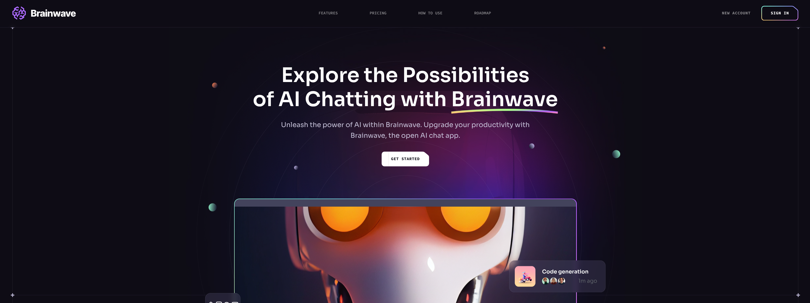

# Brainwave AI Landing Page
Uma landing page moderna e visualmente impactante para uma ferramenta de IA, focada em conversão e experiência do usuário.


[Ver projeto →](https://brainwave-ai-landing-page-pi.vercel.app/)

---

<p align="center">
  
</p>

---

## 🚀 Features

- **Animações SVG Customizadas**: Implementação de componentes SVG específicos (como `ButtonGradient`) para criar efeitos visuais sofisticados e modernos sem comprometer a performance com assets pesados.
- **Experiência Imersiva com Parallax**: Integração da biblioteca `react-just-parallax` para adicionar profundidade e dinamismo ao scroll, aumentando o engajamento do usuário.
- **Design Responsivo Utilitário**: Utilização de Tailwind CSS para garantir que a interface seja fluida em qualquer resolução, desde dispositivos móveis até monitores ultra-wide.
- **Arquitetura Modular**: Separação clara entre lógica de componentes, assets e constantes, facilitando a manutenção e a escalabilidade do código.
- **Conteúdo Desacoplado**: Todo o texto, preços e roadmap estão centralizados em um arquivo de constantes, permitindo atualizações rápidas de conteúdo sem a necessidade de alterar a estrutura dos componentes.

## 🛠️ Tecnologias

- **React** ^18.2.0
- **Vite** ^5.2.0
- **Tailwind CSS** ^3.4.4
- **React Router DOM** ^6.23.1
- **React Just Parallax** ^3.1.16
- **Scroll Lock** ^2.1.5

## 💻 Como rodar localmente

### Pré-requisitos
- Node.js instalado
- Gerenciador de pacotes (npm ou pnpm)

### Passo a passo

1. Clone o repositório:
   ```bash
   git clone https://github.com/[USUARIO]/brainwave-ai-landing-page.git
   cd brainwave-ai-landing-page
   ```

2. Instale as dependências:
   ```bash
   npm install
   # ou
   pnpm install
   ```

3. Inicie o servidor de desenvolvimento:
   ```bash
   npm run dev
   # ou
   pnpm dev
   ```

4. Acesse o projeto no navegador através da URL indicada no terminal (geralmente `http://localhost:5173`).

## 📁 Estrutura de Pastas

```text
src/
├── assets/       # Imagens, ícones e componentes SVG customizados
├── components/   # Componentes de UI reutilizáveis e seções da página
├── constants/    # Centralização de textos, links e configurações de conteúdo
├── App.jsx       # Orquestração principal das seções da landing page
└── main.jsx      # Ponto de entrada da aplicação
```

---